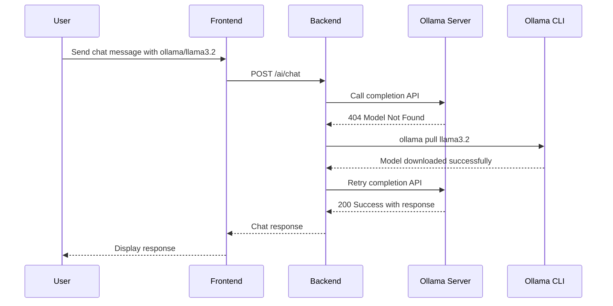

# Ollama Auto-Pull Feature Implementation

## Overview

ContextPilot now automatically downloads (pulls) Ollama models when they're not available locally. This eliminates the manual step of running `ollama pull <model>` before using a model.

## How It Works

### User Experience

1. **Select Model**: User selects any Ollama model in ContextPilot (e.g., "llama3.2")
2. **Automatic Check**: Backend checks if model is available locally
3. **Auto-Download**: If missing, automatically runs `ollama pull <model>`
4. **Seamless Chat**: Model is ready to use, user sees normal loading spinner
5. **Fast Future Requests**: Subsequent requests are instant (model already pulled)

### Technical Flow



## Implementation Details

### Backend Changes

#### 1. New Helper Methods in `AIService`

```python
def _check_ollama_model_exists(self, model: str) -> bool:
    """Check if an Ollama model is already pulled/installed."""
    
def _pull_ollama_model(self, model: str) -> bool:
    """Pull an Ollama model automatically. Returns True if successful."""
```

#### 2. Enhanced Error Handling in `_generate_ollama()`

- Catches `APIStatusError` with 404 status (model not found)
- Automatically attempts to pull the model
- Retries the API call after successful pull
- Provides helpful error messages if pull fails

#### 3. Improved User Feedback

**Before:**
```
Error: Model 'llama3.2' not found. Please pull it first: ollama pull llama3.2
```

**After (if auto-pull fails):**
```
Model 'llama3.2' not found and automatic download failed. Please pull it manually: ollama pull llama3.2
```

### Frontend Changes

#### 1. Extended Request Timeout

- Increased API timeout from default to 10 minutes
- Accommodates time needed for large model downloads
- User sees loading spinner during download

#### 2. Enhanced User Experience

- No UI changes needed - process is transparent
- Loading state shows during model download
- Error messages are more informative

## Configuration

### Timeout Settings

| Component | Timeout | Purpose |
|-----------|---------|---------|
| Frontend API | 10 minutes | Allow time for model downloads |
| Backend subprocess | 10 minutes | Ollama pull command timeout |
| Ollama API retry | 2 seconds | Wait after model pull before retry |

### Supported Models

All Ollama models are supported with auto-pull:

- **General Purpose**: `llama3.2`, `llama3.1`, `mistral`
- **Code Specialized**: `codellama`
- **Lightweight**: `phi3`
- **Custom Models**: Any model available in Ollama library

## Error Handling

### Connection Issues
```
Cannot connect to Ollama server at http://localhost:11434/v1/. 
Please ensure Ollama is installed and running. 
Install: https://ollama.ai | Start: 'ollama serve'
```

### Auto-Pull Success
```
INFO: Pulling Ollama model 'llama3.2'... This may take a few minutes.
INFO: Successfully pulled Ollama model 'llama3.2'
INFO: Model 'llama3.2' pulled successfully, retrying request...
INFO: Ollama response generated after auto-pull: llama3.2, 150 tokens
```

### Auto-Pull Failure
```
Model 'llama3.2' not found and automatic download failed. 
Please pull it manually: ollama pull llama3.2
```

## Testing

### Automated Tests

- ✅ `test_check_ollama_model_exists()` - Model availability checking
- ✅ `test_pull_ollama_model_success()` - Successful model pull
- ✅ `test_pull_ollama_model_failure()` - Failed model pull handling
- ✅ Integration with existing Ollama service tests

### Manual Testing

Use the provided test script:
```bash
cd backend
python3 test_ollama_autopull.py
```

## Performance Considerations

### First Request with New Model
- **Time**: 1-5 minutes (depends on model size)
- **User Experience**: Loading spinner, no additional UI feedback needed
- **Network**: Downloads model from Ollama registry

### Subsequent Requests
- **Time**: Normal API response time (~1-3 seconds)
- **User Experience**: Standard chat response
- **Storage**: Model cached locally by Ollama

### Model Sizes (Approximate)
- `phi3`: ~2GB (lightweight)
- `llama3.2`: ~2-4GB (recommended)
- `mistral`: ~4GB
- `llama3.1`: ~4GB
- `codellama`: ~7GB (specialized)

## Benefits

1. **Zero Configuration**: Users don't need to know about model management
2. **Seamless Experience**: First-time model use "just works"
3. **Error Resilience**: Clear fallback instructions if auto-pull fails
4. **Flexible**: Works with any Ollama model, including custom ones
5. **Efficient**: Only downloads models when needed

## Documentation Updates

- ✅ Updated README.md with auto-pull feature
- ✅ Enhanced OLLAMA_SETUP.md with optional manual installation
- ✅ Updated AI_INTEGRATION.md with technical details
- ✅ Added CHANGELOG.md entry for the feature

## Future Enhancements

### Potential Improvements

1. **Progress Indication**: Show download progress in frontend
2. **Model Pre-warming**: Download popular models in background
3. **Model Management UI**: List/delete installed models
4. **Smart Recommendations**: Suggest optimal models for user's hardware

### Current Limitations

1. No real-time download progress (user sees loading spinner)
2. Large models (7GB+) may timeout on slower connections
3. Requires Ollama CLI to be installed and accessible
4. No automatic cleanup of unused models

## Conclusion

The auto-pull feature transforms Ollama integration from a technical setup process into a seamless user experience. Users can now select any model and start chatting immediately, with ContextPilot handling the complexity of model management behind the scenes.